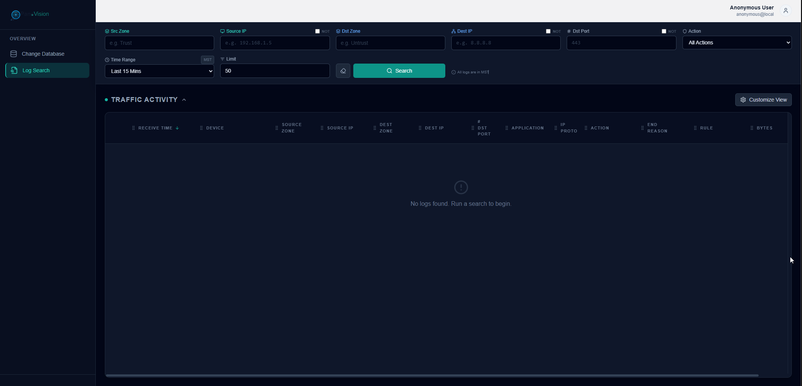
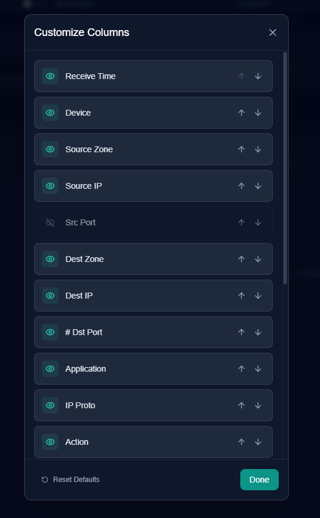

# PanoVision

A modern web application for searching and analyzing Palo Alto Networks Panorama traffic logs. PanoVision provides an intuitive interface for querying firewall logs with advanced filtering, column customization, and real-time statistics.

## Features

- **Advanced Log Search**: Query Panorama traffic logs with flexible filtering options
- **Column Customization**: Show/hide and reorder table columns to match your workflow
- **Real-time Statistics**: View total data, packets, and action distribution
- **OIDC Authentication**: Optional Azure AD/Entra ID integration for secure access
- **Responsive Design**: Modern UI built with React and Tailwind CSS
- **API Proxy**: Secure backend proxy for Panorama API communication

## Screenshots

### Main Application Interface



The main interface showing traffic log search results with filtering options, statistics, and detailed log entries.

### Column Customization



Customize which columns are displayed and their order to match your workflow preferences.

## Technology Stack

- **Frontend**: React 18, TypeScript, Vite, Tailwind CSS
- **Backend**: Node.js API proxy service
- **Web Server**: Apache HTTP Server with SSL/TLS
- **Authentication**: Azure MSAL (Microsoft Authentication Library)
- **Charts**: Recharts

## Prerequisites

- **Server**: RHEL 9.7 or compatible Linux distribution
- **Node.js**: 18+ (installed automatically by installation script)
- **Apache**: HTTP Server with mod_ssl (installed automatically)
- **Panorama Access**: Valid Panorama API key and network connectivity
- **DNS**: Domain name configured (optional, can use IP address)

## Quick Start

### Installation

1. **Clone the repository:**
   ```bash
   git clone https://github.com/your-org/Panovision.git
   cd Panovision
   ```

2. **Run the installation script:**
   ```bash
   sudo chmod +x deploy/install.sh
   sudo ./deploy/install.sh
   ```

3. **Follow the prompts:**
   - Enter your server URL or IP address
   - Enter your Panorama server URL
   - Enter your Panorama API key
   - Choose Node.js installation method (JFrog or NodeSource)
   - Configure OIDC authentication (optional)

4. **Access the application:**
   ```
   https://your-server-url/logs
   ```

For detailed installation instructions, see [INSTALLATION_GUIDE.md](INSTALLATION_GUIDE.md).

## Project Structure

```
Panovision/
├── components/          # React components
│   ├── ApiUrlModal.tsx
│   ├── ColumnCustomizer.tsx
│   ├── ErrorDiagnosisModal.tsx
│   ├── LogDetailModal.tsx
│   ├── LoginPage.tsx
│   ├── Logo.tsx
│   ├── SearchHeader.tsx
│   └── StatsWidget.tsx
├── services/           # Service layer
│   ├── authConfig.ts   # OIDC configuration
│   ├── authService.ts  # Authentication service
│   └── panoramaService.ts  # Panorama API client
├── deploy/             # Deployment scripts and configs
│   ├── install.sh     # Main installation script
│   ├── apache-panovision.conf  # Apache configuration
│   ├── api-proxy.js   # API proxy service
│   └── api-proxy.service  # Systemd service file
├── App.tsx             # Main application component
├── types.ts            # TypeScript type definitions
└── package.json        # Node.js dependencies
```

## Configuration

### Panorama API

The Panorama API key and URL are configured during installation and stored securely:
- API Key: `/etc/panovision/api-key` (640 permissions, root:panovision)
- Configuration: `/etc/panovision/panorama-config`

**Required**: Panorama server URL must be configured via `VITE_PANORAMA_SERVER` environment variable.

### OIDC Authentication (Optional)

OIDC authentication is disabled by default. To enable and set up Azure AD:

1. Create an App Registration in Azure Portal
2. Configure redirect URI: `https://your-server-url`
3. Provide Client ID and Authority during installation

For detailed OIDC setup, see [AZURE_OIDC_SETUP.md](AZURE_OIDC_SETUP.md).

### SSL Certificates

The installation script creates a self-signed certificate by default. For production:

1. **Generate a CSR:**
   ```bash
   sudo ./deploy/generate-apache-csr.sh
   ```

2. **Install your certificate:**
   ```bash
   sudo ./deploy/install-apache-ssl-cert.sh
   ```

See [deploy/APACHE_SSL_CSR.md](deploy/APACHE_SSL_CSR.md) and [deploy/APACHE_SSL_INSTALL.md](deploy/APACHE_SSL_INSTALL.md) for details.

## Development

### Local Development

1. **Install dependencies:**
   ```bash
   npm install
   ```

2. **Create environment file:**
   ```bash
   # Create .env file with required variables
   cat > .env <<EOF
   VITE_PANORAMA_SERVER=https://panorama.example.com
   VITE_OIDC_ENABLED=false
   EOF
   # Edit .env with your Panorama server URL
   ```
   
   **Required**: Set `VITE_PANORAMA_SERVER` to your Panorama server URL.
   
   **Optional**: OIDC variables are only needed if enabling authentication (see [Environment Variables](#environment-variables) section below).

3. **Run development server:**
   ```bash
   npm run dev
   ```

4. **Build for production:**
   ```bash
   export NODE_OPTIONS="--openssl-legacy-provider"
   npm run build
   ```

### Environment Variables

#### Required Variables

- `VITE_PANORAMA_SERVER`: Panorama server URL (required)
  - Example: `https://panorama.example.com` or `https://192.168.1.100`

#### Optional Variables (OIDC Authentication)

OIDC authentication is **disabled by default**. The following variables are only needed if you want to enable OIDC authentication:

- `VITE_OIDC_ENABLED`: Enable/disable OIDC authentication
  - Set to `true` or `1` to enable OIDC (default: `false`)
  - When `false` or not set, the application allows anonymous access

- `VITE_AZURE_CLIENT_ID`: Azure AD Application (client) ID
  - Required only if `VITE_OIDC_ENABLED=true`
  - Example: `12345678-1234-1234-1234-123456789012`

- `VITE_AZURE_AUTHORITY`: Azure AD authority URL
  - Required only if `VITE_OIDC_ENABLED=true`
  - Example: `https://login.microsoftonline.com/your-tenant-id`

- `VITE_AZURE_REDIRECT_URI`: OIDC redirect URI after authentication
  - Required only if `VITE_OIDC_ENABLED=true`
  - Example: `https://panovision.example.com`
  - Defaults to current origin if not specified

**Note**: For Docker deployments, these variables must be set as build arguments during the build process (see [DOCKER_DEPLOYMENT.md](DOCKER_DEPLOYMENT.md)).

## Deployment

### Updating the Application

After making changes:

```bash
cd /opt/Panovision
git pull
npm install
export NODE_OPTIONS="--openssl-legacy-provider"
npm run build
rsync -av --delete dist/ /var/www/panovision/
sudo systemctl reload httpd
```

### Service Management

```bash
# Check Apache status
sudo systemctl status httpd

# Check API proxy status
sudo systemctl status api-proxy

# View logs
sudo tail -f /var/log/httpd/panovision-error.log
sudo journalctl -u api-proxy -f
```

## Troubleshooting

### Common Issues

**Application not loading:**
- Check Apache status: `systemctl status httpd`
- Check error logs: `tail -f /var/log/httpd/panovision-error.log`
- Verify files deployed: `ls -la /var/www/panovision/`

**API proxy not working:**
- Check service status: `systemctl status api-proxy`
- View logs: `journalctl -u api-proxy -n 50`
- Verify Panorama certificate: `ls -la /etc/panovision/panorama-ca.crt`

**SSL certificate errors:**
- For Panorama: Run `sudo ./deploy/fetch-panorama-cert.sh`
- For web server: Install proper SSL certificate (see SSL documentation)

**Port conflicts:**
- Check what's using ports 80/443: `ss -tlnp | grep -E ':80|:443'`
- Stop conflicting services before installation

For more troubleshooting help, see [deploy/README.md](deploy/README.md).

## Security Considerations

1. **SSL/TLS**: Always use HTTPS in production
2. **API Key**: Stored securely with restricted permissions
3. **Firewall**: Only ports 80 and 443 should be publicly accessible
4. **OIDC**: Use tenant-specific authority for better security
5. **Updates**: Keep system and dependencies updated

## Contributing

1. Fork the repository
2. Create a feature branch
3. Make your changes
4. Submit a pull request

## License

Disclaimer: This software is provided "as is", without warranty of any kind, express or implied, including but not limited to the warranties of merchantability, fitness for a particular purpose, and noninfringement. In no event shall the author or copyright holder be liable for any claim, damages, or other liability, whether in an action of contract, tort, or otherwise, arising from, out of, or in connection with the software or the use or other dealings in the software. Use at your own risk.

## Support

For issues or questions:
- Check the [deployment documentation](deploy/README.md)
- Review [installation guide](INSTALLATION_GUIDE.md)
- Check service logs for error messages

## Related Projects

- [PaloChangeLogs](https://github.com/gsk-panda/PaloChangeLogs) - Change database application
